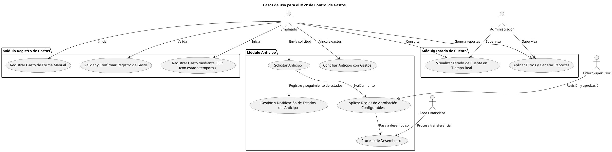
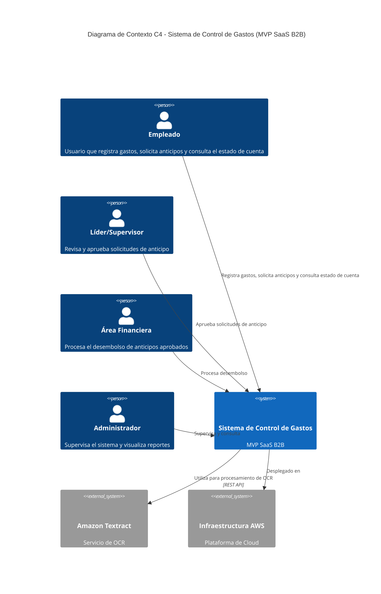
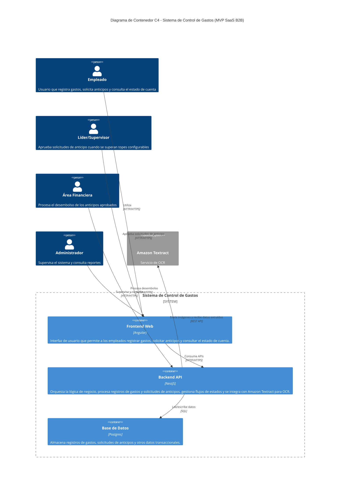
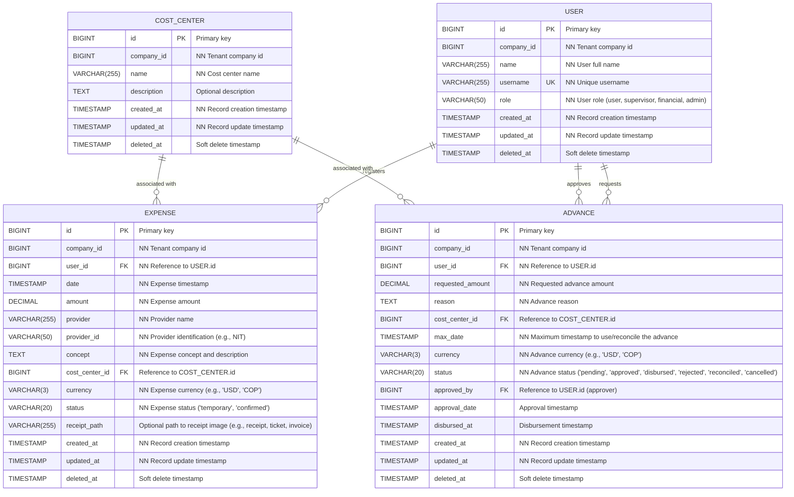

# Diseño

## Casos de uso

### Módulo 1: Registro de Gastos

1. **Registrar Gasto mediante OCR con Estado Temporal**  
   *Descripción:*  
   - El empleado sube el comprobante (imagen de factura, recibo, ticket, etc.) a la interfaz web.  
   - Inmediatamente se crea un registro de gasto en un estado temporal mientras el sistema procesa la imagen y extrae la información mediante OCR/ICR.  
   - Una vez que la extracción ha finalizado, se muestra la información extraída para que el empleado pueda confirmarla o corregirla.  
   - El empleado puede continuar registrando otros gastos o realizando otras acciones mientras se procesa el OCR.  
   *Actor(es):* Empleado  
   *Flujo Principal:*  
   - Acceso a la interfaz y carga de la imagen del comprobante.  
   - Creación del gasto en estado temporal.  
   - Procesamiento en segundo plano para extraer datos (fecha, monto, proveedor, concepto).  
   - Notificación al empleado con la información extraída, solicitando confirmación o ajustes.  
   - Confirmación definitiva del gasto, que pasa a estado final.

2. **Registrar Gasto de Forma Manual**  
   *Descripción:*  
   - Permite el ingreso manual de los datos del gasto (fecha, monto, proveedor, concepto) y de campos adicionales como nota/detalle, centro de costos y moneda.  
   - Se asocia automáticamente el gasto con el empleado y se registra la fecha/hora del ingreso.  
   *Actor(es):* Empleado  
   *Flujo Principal:*  
   - Selección de la opción de ingreso manual.  
   - Completar los campos requeridos y adicionales.  
   - Registro definitivo del gasto.

3. **Validar y Confirmar Registro de Gasto**  
   *Descripción:*  
   - En ambos modos (OCR y manual), el sistema ofrece una pantalla de validación para revisar la información antes de almacenar definitivamente el registro.  
   *Actor(es):* Empleado  
   *Flujo Principal:*  
   - Visualización de la información recopilada (ya sea extraída o ingresada manualmente).  
   - Edición y confirmación por parte del empleado.  
   - Almacenamiento definitivo del gasto para análisis futuros.

---

### Módulo 2: Anticipo

4. **Solicitar Anticipo**  
   *Descripción:*  
   - El empleado completa un formulario con los siguientes campos: valor (monto solicitado), motivo, centro de costos y fecha máxima para utilizar o conciliar el anticipo.  
   - La solicitud se asocia automáticamente al perfil del empleado y se registra la fecha/hora de ingreso.  
   *Actor(es):* Empleado  
   *Flujo Principal:*  
   - Acceso al formulario de solicitud.  
   - Ingreso de los datos requeridos.  
   - Envío y registro de la solicitud en el sistema.

5. **Aplicar Reglas de Aprobación Configurables**  
   *Descripción:*  
   - Una vez enviada la solicitud, el sistema evalúa el monto solicitado contra los topes configurables por la empresa.  
   - Si el monto supera el tope predefinido, la solicitud se envía a un líder o supervisor para revisión y aprobación manual.  
   - Si está dentro del tope, la aprobación puede realizarse de forma automática.  
   *Actor(es):* Sistema, Líder/Supervisor (cuando corresponda)  
   *Flujo Principal:*  
   - Evaluación automática del monto solicitado.  
   - Envío para aprobación manual o aprobación directa según corresponda.

6. **Proceso de Desembolso**  
   *Descripción:*  
   - Una vez aprobada la solicitud, se activa un estado adicional de "Desembolso".  
   - El área financiera procesa la transferencia de fondos al empleado.  
   - Este estado indica que el empleado ya cuenta con el dinero solicitado.  
   *Actor(es):* Área Financiera, Sistema  
   *Flujo Principal:*  
   - Cambio de estado de "Aprobado" a "Desembolsado" tras la transferencia de fondos.  
   - Registro y notificación de la actualización del estado.

7. **Gestión y Notificación de Estados del Anticipo**  
   *Descripción:*  
   - El sistema gestiona los siguientes estados para cada solicitud de anticipo:  
     - Pendiente (solicitud enviada y en espera de revisión)  
     - Aprobado  
     - Desembolsado  
     - Rechazado  
     - Conciliado (cuando se vincula el anticipo con los gastos reales)  
     - Cancelado  
   - Cada cambio de estado se registra y se notifica al empleado para mantenerlo informado del progreso de su solicitud.  
   *Actor(es):* Sistema, Empleado  
   *Flujo Principal:*  
   - Actualización de estados según el flujo del proceso.  
   - Notificaciones automáticas a los involucrados.

8. **Conciliar Anticipo con Gastos**  
   *Descripción:*  
   - Permite vincular los gastos registrados por el empleado con la solicitud de anticipo correspondiente.  
   - La conciliación ajusta el monto adelantado con el gasto real, actualizando el estado a "Conciliado" cuando corresponda.  
   *Actor(es):* Empleado  
   *Flujo Principal:*  
   - Selección de los gastos relacionados.  
   - Asociación de los gastos a la solicitud de anticipo.  
   - Actualización del estado del anticipo a "Conciliado" una vez realizada la vinculación.

---

### Módulo 3: Estado de Cuenta

9. **Visualizar Estado de Cuenta en Tiempo Real**  
   *Descripción:*  
   - El sistema ofrece un dashboard que consolida la información de gastos y anticipos, mostrando totales actualizados en tiempo real.  
   *Actor(es):* Empleado, Administrador  
   *Flujo Principal:*  
   - Acceso al dashboard mediante la interfaz web.  
   - Visualización inmediata de los totales de gastos y anticipos actualizados al instante.

10. **Aplicar Filtros y Generar Reportes**  
    *Descripción:*  
    - Para facilitar el análisis, el usuario puede aplicar filtros por criterios como fecha o centro de costos y generar reportes detallados.  
    *Actor(es):* Empleado, Administrador  
    *Flujo Principal:*  
    - Selección de filtros específicos en la interfaz.  
    - Actualización de la vista y generación de reportes basados en los criterios seleccionados.

--- 

Diagrama de casos de uso en PlantUML, representando los módulos y actores involucrados, con comentarios para clarificar cada componente:

### Descripción de los elementos:

- **Actores:**
  - **Empleado (E):** Usuario principal que registra gastos, solicita anticipos y consulta el estado de cuenta.
  - **Líder/Supervisor (LS):** Actor encargado de revisar y aprobar solicitudes de anticipo cuando el monto supera un tope configurado.
  - **Área Financiera (AF):** Responsable de procesar el desembolso una vez aprobada la solicitud.
  - **Administrador (A):** Usuario con privilegios para supervisar el estado de cuenta y generar reportes.

- **Casos de Uso:**
  - **Módulo Registro de Gastos:** Incluye el registro vía OCR (con estado temporal para permitir el procesamiento asíncrono), el registro manual y la validación final de la información.
  - **Módulo Anticipo:** Cubre la solicitud del anticipo, la aplicación de reglas de aprobación configurables, el proceso de desembolso, el seguimiento de estados y la conciliación de gastos.
  - **Módulo Estado de Cuenta:** Permite la visualización en tiempo real del estado financiero y la generación de reportes mediante filtros.

---

## C4 Daigrams

A continuación, cada uno de los componentes y actores involucrados:

---

**Sistema de Control de Gastos (MVP SaaS B2B)**  
Este es el sistema central que facilita el registro de gastos, la solicitud y gestión de anticipos, y la visualización en tiempo real del estado de cuenta.

**Componentes Internos:**

1. **Frontend Web (Angular):**  
   - **Descripción:** La interfaz de usuario que permite a los empleados, supervisores, área financiera y administradores interactuar con el sistema.  
   - **Responsabilidades:**  
     - Permitir el registro de gastos (tanto por OCR como manual).  
     - Facilitar la solicitud de anticipos.  
     - Proveer vistas en tiempo real del estado de cuenta y opciones para filtrar y generar reportes.

2. **Backend (NestJS):**  
   - **Descripción:** La capa de lógica de negocio y orquestación del sistema.  
   - **Responsabilidades:**  
     - Procesar las solicitudes provenientes del frontend.  
     - Gestionar el flujo de estados (gastos temporales, validaciones, solicitudes de anticipo, desembolso, etc.).  
     - Integrar y coordinar el servicio de OCR (Amazon Textract) para la extracción de datos.  
     - Aplicar reglas de aprobación configurables para anticipos.

3. **Base de Datos (Postgres):**  
   - **Descripción:** El repositorio central donde se almacenan los registros de gastos, solicitudes de anticipos y otros datos relevantes.  
   - **Responsabilidades:**  
     - Garantizar la persistencia, integridad y disponibilidad de la información.  
     - Facilitar consultas y generación de reportes para el dashboard del estado de cuenta.

4. **Servicio de OCR (Amazon Textract):**  
   - **Descripción:** Servicio externo que se integra mediante API para procesar imágenes de comprobantes y extraer información relevante (fecha, monto, proveedor, concepto).  
   - **Responsabilidades:**  
     - Procesar las imágenes de manera asíncrona, permitiendo crear inicialmente un registro en estado temporal en el sistema.  
     - Proveer los datos extraídos que posteriormente serán validados y confirmados por el empleado.

5. **Infraestructura en AWS:**  
   - **Descripción:** El entorno de hosting y despliegue que soporta la aplicación.  
   - **Responsabilidades:**  
     - Hospedar el frontend, backend y base de datos.  
     - Escalar y asegurar el correcto funcionamiento del sistema a nivel de red, disponibilidad y seguridad básica.

---

**Actores Externos:**

1. **Empleado:**  
   - Interactúa con la interfaz para registrar gastos, validar datos extraídos por OCR, solicitar anticipos y consultar el estado de cuenta.

2. **Líder/Supervisor:**  
   - Revisa y aprueba (cuando se requiera) las solicitudes de anticipo que superen los topes configurables.

3. **Área Financiera:**  
   - Procesa el desembolso una vez que la solicitud de anticipo ha sido aprobada, gestionando la transferencia de fondos.

4. **Administrador:**  
   - Supervisa el sistema y el estado de cuenta, y podría tener acceso a configuraciones y reportes, aunque en este MVP su rol se limita mayormente a la visualización.

### Diagrama de conexto

### Diagrama de contenedores

---

## Modelo de datos

A continuación se presenta el modelo de datos:

## 1. Entities

### a. User  
**Descripción:**  
Representa a los usuarios del sistema, incluyendo empleados, supervisores, financieros y administradores. Cada usuario pertenece a una compañía (tenant) y se identifica de manera única por su id y username.

**Campos:**  
- **id:** (PK) Identificador único del usuario.  
  *Tipo:* UUID o Integer.
- **company_id:** Identificador de la compañía a la que pertenece el usuario (para control de tenants).  
  *Tipo:* UUID o Integer, no nulo.
- **name:** Nombre completo del usuario.  
  *Tipo:* VARCHAR(255), no nulo.
- **username:** Nombre de usuario o correo único (antes email).  
  *Tipo:* VARCHAR(255), no nulo, UNIQUE.
- **role:** Rol del usuario en el sistema (ej.: 'user', 'supervisor', 'financial', 'admin').  
  *Tipo:* ENUM o VARCHAR(50), no nulo.
- **created_at:** Fecha y hora de creación del registro.  
  *Tipo:* TIMESTAMP, no nulo.
- **updated_at:** Fecha y hora de la última actualización.  
  *Tipo:* TIMESTAMP, no nulo.
- **deleted_at:** Fecha y hora de borrado lógico (puede ser NULL si no se ha eliminado).  
  *Tipo:* TIMESTAMP, NULL.

---

### b. CostCenter  
**Descripción:**  
Representa un centro de costos o área, que clasifica y agrupa transacciones según áreas o proyectos, asociado a una compañía.

**Campos:**  
- **id:** (PK) Identificador único del centro de costos.  
  *Tipo:* UUID o Integer.
- **company_id:** Identificador de la compañía a la que pertenece el centro de costos.  
  *Tipo:* UUID o Integer, no nulo.
- **name:** Nombre del centro de costos.  
  *Tipo:* VARCHAR(255), no nulo.
- **description:** Detalle o descripción del centro de costos.  
  *Tipo:* TEXT, opcional.
- **created_at:** Fecha y hora de creación.  
  *Tipo:* TIMESTAMP, no nulo.
- **updated_at:** Fecha y hora de actualización.  
  *Tipo:* TIMESTAMP, no nulo.
- **deleted_at:** Fecha y hora de borrado lógico.  
  *Tipo:* TIMESTAMP, NULL.

---

### c. Expense  
**Descripción:**  
Representa el registro de un gasto, capturado tanto mediante OCR (con un estado temporal) como manualmente. Cada gasto se asocia a un usuario y opcionalmente a un centro de costos, y se almacena junto con la información relevante, incluyendo la identificación del proveedor (por ejemplo, NIT en Colombia).

**Campos:**  
- **id:** (PK) Identificador único del gasto.  
  *Tipo:* UUID o Integer.
- **company_id:** Identificador de la compañía a la que pertenece el registro del gasto.  
  *Tipo:* UUID o Integer, no nulo.
- **user_id:** (FK) Identificador del usuario que registró el gasto.  
  *Tipo:* UUID o Integer, referencia a `User.id`, no nulo.
- **date:** Fecha del gasto, según el comprobante o ingresado manualmente.  
  *Tipo:* DATE, no nulo.
- **amount:** Monto del gasto.  
  *Tipo:* DECIMAL(10,2), no nulo.
- **provider:** Nombre o descripción del proveedor.  
  *Tipo:* VARCHAR(255), no nulo.
- **provider_id:** Identificación del proveedor (por ejemplo, NIT en Colombia).  
  *Tipo:* VARCHAR(50), no nulo.
- **concept:** Concepto o descripción del gasto (incluye lo que antes se consideraba "note").  
  *Tipo:* TEXT, no nulo.
- **cost_center_id:** (FK) Centro de costos asociado al gasto.  
  *Tipo:* UUID o Integer, referencia a `CostCenter.id`, opcional.
- **currency:** Código de la divisa del gasto (ej.: 'USD', 'COP').  
  *Tipo:* VARCHAR(3), no nulo.
- **status:** Estado del gasto; por ejemplo, 'temporary' (durante el procesamiento OCR) o 'confirmed' (una vez validado).  
  *Tipo:* ENUM('temporary', 'confirmed') o VARCHAR(20), no nulo.
- **receipt_path:** Se utiliza para almacenar la ruta o URL de la imagen asociada al comprobante del gasto (por ejemplo, recibo, ticket, factura, etc.).   
- **created_at:** Fecha y hora de registro.  
  *Tipo:* TIMESTAMP, no nulo.
- **updated_at:** Fecha y hora de última actualización.  
  *Tipo:* TIMESTAMP, no nulo.
- **deleted_at:** Fecha y hora de borrado lógico.  
  *Tipo:* TIMESTAMP, NULL.

---

### d. Advance  
**Descripción:**  
Representa una solicitud de anticipo de fondos realizada por un usuario. Incluye información de la solicitud, monto, motivo, centro de costos, moneda y seguimiento de los estados a lo largo del flujo (pendiente, approved, disbursed, rejected, reconciled, cancelled).

**Campos:**  
- **id:** (PK) Identificador único de la solicitud de anticipo.  
  *Tipo:* UUID o Integer.
- **company_id:** Identificador de la compañía a la que pertenece la solicitud.  
  *Tipo:* UUID o Integer, no nulo.
- **user_id:** (FK) Identificador del usuario que solicita el anticipo.  
  *Tipo:* UUID o Integer, referencia a `User.id`, no nulo.
- **requested_amount:** Monto solicitado para el anticipo.  
  *Tipo:* DECIMAL(10,2), no nulo.
- **reason:** Motivo o justificación del anticipo.  
  *Tipo:* TEXT, no nulo.
- **cost_center_id:** (FK) Centro de costos asociado a la solicitud, si aplica.  
  *Tipo:* UUID o Integer, referencia a `CostCenter.id`, opcional.
- **max_date:** Fecha máxima para utilizar o conciliar el anticipo.  
  *Tipo:* DATE, no nulo.
- **currency:** Código de la divisa del anticipo (ej.: 'USD', 'COP').  
  *Tipo:* VARCHAR(3), no nulo.
- **status:** Estado actual de la solicitud de anticipo.  
  *Tipo:* ENUM('pending', 'approved', 'disbursed', 'rejected', 'reconciled', 'cancelled') o VARCHAR(20), no nulo.
- **approved_by:** (FK) Identificador del usuario (por ejemplo, supervisor) que aprobó la solicitud.  
  *Tipo:* UUID o Integer, referencia a `User.id`, opcional.
- **approval_date:** Fecha y hora en que se aprobó la solicitud.  
  *Tipo:* TIMESTAMP, opcional.
- **disbursed_at:** Fecha y hora en que se realizó el desembolso.  
  *Tipo:* TIMESTAMP, opcional.
- **created_at:** Fecha y hora de creación de la solicitud.  
  *Tipo:* TIMESTAMP, no nulo.
- **updated_at:** Fecha y hora de la última actualización.  
  *Tipo:* TIMESTAMP, no nulo.
- **deleted_at:** Fecha y hora de borrado lógico.  
  *Tipo:* TIMESTAMP, NULL.

---

## 2. Relaciones entre Entidades

- **User – Expense:**  
  Un usuario puede registrar muchos gastos.  
  **Relación:** Uno a muchos (1:N)  
  **Implementación:** El campo `Expense.user_id` es una FK que referencia a `User.id`.

- **User – Advance:**  
  Un usuario puede solicitar múltiples avances.  
  **Relación:** Uno a muchos (1:N)  
  **Implementación:** El campo `Advance.user_id` es una FK que referencia a `User.id`.

- **User (Supervisor) – Advance:**  
  Un usuario con rol de supervisor puede aprobar múltiples solicitudes de anticipo.  
  **Relación:** Uno a muchos (1:N)  
  **Implementación:** El campo `Advance.approved_by` es una FK que referencia a `User.id`.

- **CostCenter – Expense:**  
  Un centro de costos puede estar asociado a múltiples gastos.  
  **Relación:** Uno a muchos (1:N)  
  **Implementación:** El campo `Expense.cost_center_id` es una FK que referencia a `CostCenter.id`.

- **CostCenter – Advance:**  
  Un centro de costos puede agrupar varias solicitudes de anticipo.  
  **Relación:** Uno a muchos (1:N)  
  **Implementación:** El campo `Advance.cost_center_id` es una FK que referencia a `CostCenter.id`.

---

## 3. Constraints y Consideraciones

- **Primary Keys:**  
  Cada entidad utiliza el campo `id` como clave primaria.

- **Foreign Keys:**  
  - `Expense.user_id` → `User.id`
  - `Expense.cost_center_id` → `CostCenter.id`
  - `Advance.user_id` → `User.id`
  - `Advance.approved_by` → `User.id`
  - `Advance.cost_center_id` → `CostCenter.id`

- **Soft Deletes:**  
  El campo `deleted_at` en cada entidad permite el borrado lógico sin eliminar físicamente los registros.

- **Tenant Control:**  
  El campo `company_id` en todas las entidades garantiza la segregación y control de datos por cliente.

- **Tipos y Validaciones:**  
  Se recomienda utilizar tipos de datos precisos (por ejemplo, DECIMAL para montos, TIMESTAMP para fechas y horas) y establecer constraints de NOT NULL y UNIQUE donde corresponda (por ejemplo, en `User.username`).

---

## Diagrama relacional

---

### Diagrama de arquitectura

```mermaid
architecture-beta
    group dns_cdn(cloud)[DNS]
    
    service route53(cloud)[Route 53] in dns_cdn
    service cloudfront(internet)[CloudFront] in dns_cdn
    route53:R -- L:cloudfront

    group frontend(storage)[Frontend]
    service s3(disk)[S3 Angular App] in frontend
    cloudfront:B -- T:s3 

    group backend(compute)[Backend]
    service ecs(server)[ECS Fargate NestJS App] in backend
    service rds(database)[RDS PostgreSQL] in backend
    service textract(server)[Amazon Textract] in backend
    ecs:R -- L:rds
    ecs:R -- L:textract

    ecs:B -- T:s3 
```

**Descripción de la Arquitectura en AWS para el MVP:**

- **Route 53:** Gestiona la resolución de DNS para dirigir el tráfico de la aplicación.  
- **CloudFront:** Distribuye contenido globalmente y mejora la latencia y seguridad de la aplicación.  
- **S3 (Angular App):** Aloja la aplicación frontend estática desarrollada en Angular.  
- **ECS Fargate (NestJS App):** Ejecuta el backend desarrollado en NestJS, orquestando la lógica de negocio y gestionando las solicitudes de la aplicación.  
- **RDS (PostgreSQL):** Base de datos relacional administrada que almacena los registros críticos del sistema.  
- **Amazon Textract:** Servicio de OCR que extrae información de comprobantes, integrándose directamente en la lógica del backend.

Esta arquitectura aprovecha servicios administrados de AWS para lograr un despliegue ágil, escalable y seguro, ideal para la fase MVP del sistema.
