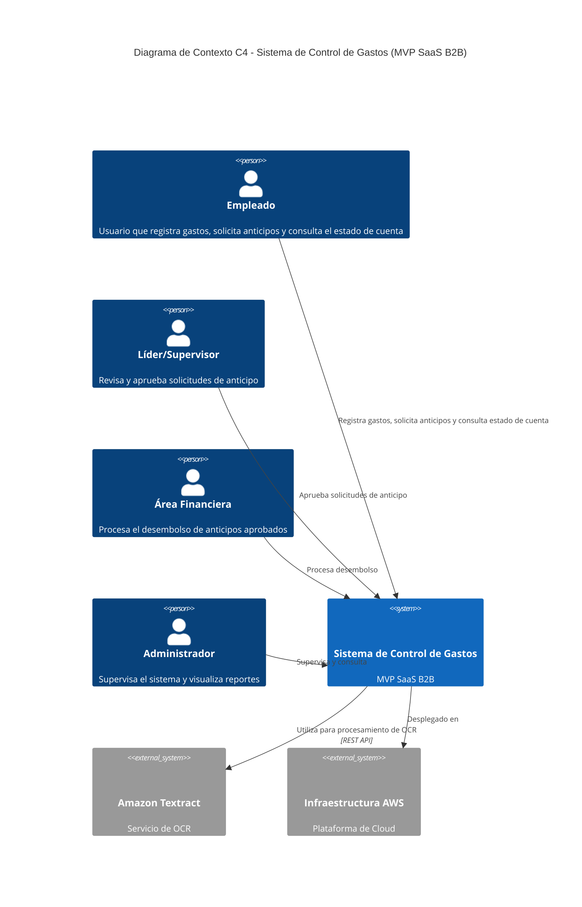
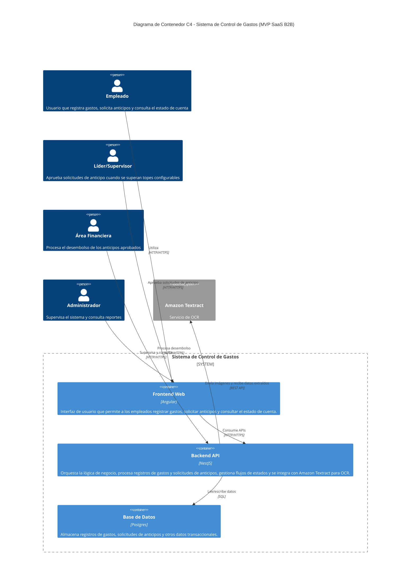
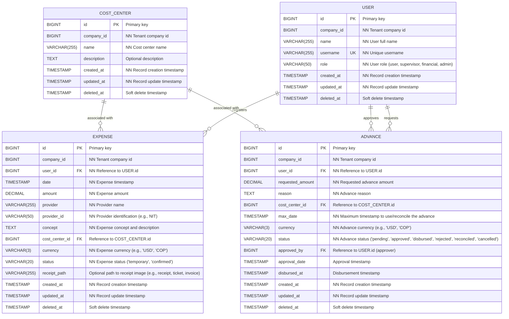

## Índice

0. [Ficha del proyecto](#0-ficha-del-proyecto)
1. [Descripción general del producto](#1-descripción-general-del-producto)
2. [Arquitectura del sistema](#2-arquitectura-del-sistema)
3. [Modelo de datos](#3-modelo-de-datos)
4. [Especificación de la API](#4-especificación-de-la-api)
5. [Historias de usuario](#5-historias-de-usuario)
6. [Tickets de trabajo](#6-tickets-de-trabajo)
7. [Pull requests](#7-pull-requests)

---

## 0. Ficha del proyecto

### **0.1. Tu nombre completo:**
Heyward Jimenez

### **0.2. Nombre del proyecto:**
Gastos360

### **0.3. Descripción breve del proyecto:**
Sistema de gestión y control de gastos de empleados para pymes.

### **0.4. URL del proyecto:**
> Se completará en la etapa de desarrollo del proyecto.

### 0.5. URL o archivo comprimido del repositorio
> Se completará en la etapa de desarrollo del proyecto.

---

## 1. Descripción general del producto

### **1.1. Objetivo:**


El proyecto es un SaaS B2B dirigido a pymes (especialmente en el mercado colombiano, con proyección hacia otros países de Latinoamérica) que necesitan digitalizar y automatizar la gestión de gastos corporativos. La solución busca reducir el tiempo administrativo y los errores asociados a los procesos manuales, facilitando el registro, la gestión de anticipos y la visualización del estado financiero a través de un sistema web.

### **1.2. Características y funcionalidades principales:**


- Registro de Gastos: Permite que el empleado registre sus gastos en tiempo real, de forma directa y sin requerir procesos de aprobación, capturando la información necesaria tanto mediante OCR como de forma manual.
- Anticipo: Permite que el empleado solicite anticipos de fondos, aplicando reglas de aprobación basadas en topes y roles de liderazgo, gestionar sus estados (incluyendo desembolso) y facilitar la conciliación posterior con los gastos registrados.
- Estado de Cuenta: Proveer una visión consolidada de los gastos y anticipos, facilitando el seguimiento y análisis de la situación financiera del usuario.

### **1.3. Diseño y experiencia de usuario:**
> Se completará en la etapa de desarrollo del proyecto.

### **1.4. Instrucciones de instalación:**
> Se completará en la etapa de desarrollo del proyecto.

---

## 2. Arquitectura del Sistema

### **2.1. Diagrama de arquitectura:**


**Componentes Internos:**

1. **Frontend Web (Angular):**  
   - **Descripción:** La interfaz de usuario que permite a los empleados, supervisores, área financiera y administradores interactuar con el sistema.  
   - **Responsabilidades:**  
     - Permitir el registro de gastos (tanto por OCR como manual).  
     - Facilitar la solicitud de anticipos.  
     - Proveer vistas en tiempo real del estado de cuenta y opciones para filtrar y generar reportes.

2. **Backend (NestJS):**  
   - **Descripción:** La capa de lógica de negocio y orquestación del sistema.  
   - **Responsabilidades:**  
     - Procesar las solicitudes provenientes del frontend.  
     - Gestionar el flujo de estados (gastos temporales, validaciones, solicitudes de anticipo, desembolso, etc.).  
     - Integrar y coordinar el servicio de OCR (Amazon Textract) para la extracción de datos.  
     - Aplicar reglas de aprobación configurables para anticipos.

3. **Base de Datos (Postgres):**  
   - **Descripción:** El repositorio central donde se almacenan los registros de gastos, solicitudes de anticipos y otros datos relevantes.  
   - **Responsabilidades:**  
     - Garantizar la persistencia, integridad y disponibilidad de la información.  
     - Facilitar consultas y generación de reportes para el dashboard del estado de cuenta.

4. **Servicio de OCR (Amazon Textract):**  
   - **Descripción:** Servicio externo que se integra mediante API para procesar imágenes de comprobantes y extraer información relevante (fecha, monto, proveedor, concepto).  
   - **Responsabilidades:**  
     - Procesar las imágenes de manera asíncrona, permitiendo crear inicialmente un registro en estado temporal en el sistema.  
     - Proveer los datos extraídos que posteriormente serán validados y confirmados por el empleado.

5. **Infraestructura en AWS:**  
   - **Descripción:** El entorno de hosting y despliegue que soporta la aplicación.  
   - **Responsabilidades:**  
     - Hospedar el frontend, backend y base de datos.  
     - Escalar y asegurar el correcto funcionamiento del sistema a nivel de red, disponibilidad y seguridad básica.

---

**Actores Externos:**

1. **Empleado:**  
   - Interactúa con la interfaz para registrar gastos, validar datos extraídos por OCR, solicitar anticipos y consultar el estado de cuenta.

2. **Líder/Supervisor:**  
   - Revisa y aprueba (cuando se requiera) las solicitudes de anticipo que superen los topes configurables.

3. **Área Financiera:**  
   - Procesa el desembolso una vez que la solicitud de anticipo ha sido aprobada, gestionando la transferencia de fondos.

4. **Administrador:**  
   - Supervisa el sistema y el estado de cuenta, y podría tener acceso a configuraciones y reportes, aunque en este MVP su rol se limita mayormente a la visualización.


### Diagrama de conexto





### Diagrama de contenedores




### **2.2. Descripción de componentes principales:**

- **Frontend Web (Angular):** La interfaz de usuario que permite a los empleados, supervisores, área financiera y administradores interactuar con el sistema.
- **Backend (NestJS):** La capa de lógica de negocio y orquestación del sistema.
- **Base de Datos (Postgres):** El repositorio central donde se almacenan los registros de gastos, solicitudes de anticipos y otros datos relevantes.
- **Servicio de OCR (Amazon Textract):** Servicio externo que se integra mediante API para procesar imágenes de comprobantes y extraer información relevante.

### **2.3. Descripción de alto nivel del proyecto y estructura de ficheros**

A continuación se muestra la estructura de ficheros para el backend en NestJS, basada en una arquitectura orientada por dominio (Domain-Driven Design). Esta organización separa las responsabilidades en diferentes capas para lograr un código modular, mantenible y escalable.

```
/src
 ├── /domain
 │    ├── /expense
 │    │     ├── entities/
 │    │     │     └── expense.entity.ts        // Entidad de gasto
 │    │     ├── interfaces/
 │    │     │     └── expense-repository.interface.ts  // Interfaz del repositorio
 │    │     ├── services/
 │    │     │     └── expense.service.ts       // Lógica de negocio
 │    │     └── exceptions/
 │    │           └── expense.exceptions.ts    // Excepciones del dominio
 │    ├── /advance
 │    │     ├── entities/
 │    │     │     └── advance.entity.ts
 │    │     ├── interfaces/
 │    │     │     └── advance-repository.interface.ts
 │    │     ├── services/
 │    │     │     └── advance.service.ts
 │    │     └── exceptions/
 │    │           └── advance.exceptions.ts
 │    ├── /user
 │    │     ├── entities/
 │    │     │     └── user.entity.ts
 │    │     ├── interfaces/
 │    │     │     └── user-repository.interface.ts
 │    │     └── services/
 │    │           └── user.service.ts
 │    └── /cost-center
 │          ├── entities/
 │          │     └── cost-center.entity.ts
 │          ├── interfaces/
 │          │     └── cost-center-repository.interface.ts
 │          └── services/
 │                └── cost-center.service.ts
 │
 ├── /application
 │    ├── /expense
 │    │     └── expense.use-case.ts
 │    ├── /advance
 │    │     └── advance.use-case.ts
 │    └── /user
 │          └── user.use-case.ts
 │
 ├── /infrastructure
 │    ├── /database
 │    │     ├── postgres.config.ts
 │    │     └── /repositories
 │    │             ├── expense.repository.ts
 │    │             ├── advance.repository.ts
 │    │             ├── user.repository.ts
 │    │             └── cost-center.repository.ts
 │    ├── /services
 │    │     ├── ocr.service.ts
 │    │     └── notification.service.ts
 │    └── /api
 │          ├── /controllers
 │          │       ├── expense.controller.ts
 │          │       ├── advance.controller.ts
 │          │       ├── user.controller.ts
 │          │       └── cost-center.controller.ts
 │          └── app.module.ts
 │
 ├── /shared
 │    ├── /utils
 │    │     ├── logger.service.ts
 │    │     └── error-handler.ts
 │    └── /config
 │          ├── app.config.ts
 │          └── env.config.ts
 │
 └── main.ts                             // Punto de entrada de la aplicación NestJS
 
/test                                    // Directorio de pruebas
/nest-cli.json                           // Configuración de NestJS
/package.json                            // Dependencias y scripts
/tsconfig.json                           // Configuración de TypeScript
/README.md                               // Documentación general del proyecto
```

### Explicación de la estructura

- **/domain:**  
  Aquí se encuentran los modelos de dominio (entidades, interfaces de repositorios y servicios de dominio). Cada subdominio (gastos, anticipos, usuarios, centros de costos) se agrupa en su propia carpeta.

- **/application:**  
  Se definen los casos de uso que coordinan las operaciones entre el dominio y la infraestructura. Esta capa se encarga de orquestar la lógica de negocio de forma agnóstica a los detalles de implementación.

- **/infrastructure:**  
  Contiene la implementación concreta de interfaces definidas en el dominio, como la conexión a la base de datos (repositorios) y la integración con servicios externos (OCR, notificaciones). Además, se encuentran las rutas de la API y la configuración del servidor.

- **/shared:**  
  Recursos y utilidades compartidas a lo largo del proyecto, como configuraciones, logger y manejadores de errores.

- **/tests:**  
  Conjunto de pruebas unitarias e integrales para validar la funcionalidad del dominio y la correcta integración con la infraestructura.

Esta estructura favorece el desacoplamiento entre capas y permite que cada parte evolucione de forma independiente, facilitando el mantenimiento y la escalabilidad del proyecto.

### **2.4. Infraestructura y despliegue**


**Infraestructura en AWS:**  
- **Route 53:** Gestiona la resolución de DNS para dirigir el tráfico de la aplicación.  
- **CloudFront:** Distribuye contenido globalmente y mejora la latencia y seguridad de la aplicación.  
- **S3 (Angular App):** Aloja la aplicación frontend estática desarrollada en Angular.  
- **ECS Fargate (NestJS App):** Ejecuta el backend desarrollado en NestJS, orquestando la lógica de negocio y gestionando las solicitudes de la aplicación.  
- **RDS (PostgreSQL):** Base de datos relacional administrada que almacena los registros críticos del sistema.  
- **Amazon Textract:** Servicio de OCR que extrae información de comprobantes, integrándose directamente en la lógica del backend.

```mermaid
architecture-beta
    group dns_cdn(cloud)[DNS]
    
    service route53(cloud)[Route 53] in dns_cdn
    service cloudfront(internet)[CloudFront] in dns_cdn
    route53:R -- L:cloudfront

    group frontend(storage)[Frontend]
    service s3(disk)[S3 Angular App] in frontend
    cloudfront:B -- T:s3 

    group backend(compute)[Backend]
    service ecs(server)[ECS Fargate NestJS App] in backend
    service rds(database)[RDS PostgreSQL] in backend
    service textract(server)[Amazon Textract] in backend
    ecs:R -- L:rds
    ecs:R -- L:textract

    ecs:B -- T:s3 
```



### **2.5. Seguridad**

> Se completará en la etapa de desarrollo del proyecto.

### **2.6. Tests**

> Se completará en la etapa de desarrollo del proyecto.

---

## 3. Modelo de Datos

### **3.1. Diagrama del modelo de datos:**



### **3.2. Descripción de entidades principales:**


## 1. Entities

### a. User  
**Descripción:**  
Representa a los usuarios del sistema, incluyendo empleados, supervisores, financieros y administradores. Cada usuario pertenece a una compañía (tenant) y se identifica de manera única por su id y username.

**Campos:**  
- **id:** (PK) Identificador único del usuario.  
  *Tipo:* UUID o Integer.
- **company_id:** Identificador de la compañía a la que pertenece el usuario (para control de tenants).  
  *Tipo:* UUID o Integer, no nulo.
- **name:** Nombre completo del usuario.  
  *Tipo:* VARCHAR(255), no nulo.
- **username:** Nombre de usuario o correo único (antes email).  
  *Tipo:* VARCHAR(255), no nulo, UNIQUE.
- **role:** Rol del usuario en el sistema (ej.: 'user', 'supervisor', 'financial', 'admin').  
  *Tipo:* ENUM o VARCHAR(50), no nulo.
- **created_at:** Fecha y hora de creación del registro.  
  *Tipo:* TIMESTAMP, no nulo.
- **updated_at:** Fecha y hora de la última actualización.  
  *Tipo:* TIMESTAMP, no nulo.
- **deleted_at:** Fecha y hora de borrado lógico (puede ser NULL si no se ha eliminado).  
  *Tipo:* TIMESTAMP, NULL.

---

### b. CostCenter  
**Descripción:**  
Representa un centro de costos o área, que clasifica y agrupa transacciones según áreas o proyectos, asociado a una compañía.

**Campos:**  
- **id:** (PK) Identificador único del centro de costos.  
  *Tipo:* UUID o Integer.
- **company_id:** Identificador de la compañía a la que pertenece el centro de costos.  
  *Tipo:* UUID o Integer, no nulo.
- **name:** Nombre del centro de costos.  
  *Tipo:* VARCHAR(255), no nulo.
- **description:** Detalle o descripción del centro de costos.  
  *Tipo:* TEXT, opcional.
- **created_at:** Fecha y hora de creación.  
  *Tipo:* TIMESTAMP, no nulo.
- **updated_at:** Fecha y hora de actualización.  
  *Tipo:* TIMESTAMP, no nulo.
- **deleted_at:** Fecha y hora de borrado lógico.  
  *Tipo:* TIMESTAMP, NULL.

---

### c. Expense  
**Descripción:**  
Representa el registro de un gasto, capturado tanto mediante OCR (con un estado temporal) como manualmente. Cada gasto se asocia a un usuario y opcionalmente a un centro de costos, y se almacena junto con la información relevante, incluyendo la identificación del proveedor (por ejemplo, NIT en Colombia).

**Campos:**  
- **id:** (PK) Identificador único del gasto.  
  *Tipo:* UUID o Integer.
- **company_id:** Identificador de la compañía a la que pertenece el registro del gasto.  
  *Tipo:* UUID o Integer, no nulo.
- **user_id:** (FK) Identificador del usuario que registró el gasto.  
  *Tipo:* UUID o Integer, referencia a `User.id`, no nulo.
- **date:** Fecha del gasto, según el comprobante o ingresado manualmente.  
  *Tipo:* DATE, no nulo.
- **amount:** Monto del gasto.  
  *Tipo:* DECIMAL(10,2), no nulo.
- **provider:** Nombre o descripción del proveedor.  
  *Tipo:* VARCHAR(255), no nulo.
- **provider_id:** Identificación del proveedor (por ejemplo, NIT en Colombia).  
  *Tipo:* VARCHAR(50), no nulo.
- **concept:** Concepto o descripción del gasto (incluye lo que antes se consideraba "note").  
  *Tipo:* TEXT, no nulo.
- **cost_center_id:** (FK) Centro de costos asociado al gasto.  
  *Tipo:* UUID o Integer, referencia a `CostCenter.id`, opcional.
- **currency:** Código de la divisa del gasto (ej.: 'USD', 'COP').  
  *Tipo:* VARCHAR(3), no nulo.
- **status:** Estado del gasto; por ejemplo, 'temporary' (durante el procesamiento OCR) o 'confirmed' (una vez validado).  
  *Tipo:* ENUM('temporary', 'confirmed') o VARCHAR(20), no nulo.
- **receipt_path:** Se utiliza para almacenar la ruta o URL de la imagen asociada al comprobante del gasto (por ejemplo, recibo, ticket, factura, etc.).   
- **created_at:** Fecha y hora de registro.  
  *Tipo:* TIMESTAMP, no nulo.
- **updated_at:** Fecha y hora de última actualización.  
  *Tipo:* TIMESTAMP, no nulo.
- **deleted_at:** Fecha y hora de borrado lógico.  
  *Tipo:* TIMESTAMP, NULL.

---

### d. Advance  
**Descripción:**  
Representa una solicitud de anticipo de fondos realizada por un usuario. Incluye información de la solicitud, monto, motivo, centro de costos, moneda y seguimiento de los estados a lo largo del flujo (pendiente, approved, disbursed, rejected, reconciled, cancelled).

**Campos:**  
- **id:** (PK) Identificador único de la solicitud de anticipo.  
  *Tipo:* UUID o Integer.
- **company_id:** Identificador de la compañía a la que pertenece la solicitud.  
  *Tipo:* UUID o Integer, no nulo.
- **user_id:** (FK) Identificador del usuario que solicita el anticipo.  
  *Tipo:* UUID o Integer, referencia a `User.id`, no nulo.
- **requested_amount:** Monto solicitado para el anticipo.  
  *Tipo:* DECIMAL(10,2), no nulo.
- **reason:** Motivo o justificación del anticipo.  
  *Tipo:* TEXT, no nulo.
- **cost_center_id:** (FK) Centro de costos asociado a la solicitud, si aplica.  
  *Tipo:* UUID o Integer, referencia a `CostCenter.id`, opcional.
- **max_date:** Fecha máxima para utilizar o conciliar el anticipo.  
  *Tipo:* DATE, no nulo.
- **currency:** Código de la divisa del anticipo (ej.: 'USD', 'COP').  
  *Tipo:* VARCHAR(3), no nulo.
- **status:** Estado actual de la solicitud de anticipo.  
  *Tipo:* ENUM('pending', 'approved', 'disbursed', 'rejected', 'reconciled', 'cancelled') o VARCHAR(20), no nulo.
- **approved_by:** (FK) Identificador del usuario (por ejemplo, supervisor) que aprobó la solicitud.  
  *Tipo:* UUID o Integer, referencia a `User.id`, opcional.
- **approval_date:** Fecha y hora en que se aprobó la solicitud.  
  *Tipo:* TIMESTAMP, opcional.
- **disbursed_at:** Fecha y hora en que se realizó el desembolso.  
  *Tipo:* TIMESTAMP, opcional.
- **created_at:** Fecha y hora de creación de la solicitud.  
  *Tipo:* TIMESTAMP, no nulo.
- **updated_at:** Fecha y hora de la última actualización.  
  *Tipo:* TIMESTAMP, no nulo.
- **deleted_at:** Fecha y hora de borrado lógico.  
  *Tipo:* TIMESTAMP, NULL.

---

## 2. Relaciones entre Entidades

- **User – Expense:**  
  Un usuario puede registrar muchos gastos.  
  **Relación:** Uno a muchos (1:N)  
  **Implementación:** El campo `Expense.user_id` es una FK que referencia a `User.id`.

- **User – Advance:**  
  Un usuario puede solicitar múltiples avances.  
  **Relación:** Uno a muchos (1:N)  
  **Implementación:** El campo `Advance.user_id` es una FK que referencia a `User.id`.

- **User (Supervisor) – Advance:**  
  Un usuario con rol de supervisor puede aprobar múltiples solicitudes de anticipo.  
  **Relación:** Uno a muchos (1:N)  
  **Implementación:** El campo `Advance.approved_by` es una FK que referencia a `User.id`.

- **CostCenter – Expense:**  
  Un centro de costos puede estar asociado a múltiples gastos.  
  **Relación:** Uno a muchos (1:N)  
  **Implementación:** El campo `Expense.cost_center_id` es una FK que referencia a `CostCenter.id`.

- **CostCenter – Advance:**  
  Un centro de costos puede agrupar varias solicitudes de anticipo.  
  **Relación:** Uno a muchos (1:N)  
  **Implementación:** El campo `Advance.cost_center_id` es una FK que referencia a `CostCenter.id`.

---

## 3. Constraints y Consideraciones

- **Primary Keys:**  
  Cada entidad utiliza el campo `id` como clave primaria.

- **Foreign Keys:**  
  - `Expense.user_id` → `User.id`
  - `Expense.cost_center_id` → `CostCenter.id`
  - `Advance.user_id` → `User.id`
  - `Advance.approved_by` → `User.id`
  - `Advance.cost_center_id` → `CostCenter.id`

- **Soft Deletes:**  
  El campo `deleted_at` en cada entidad permite el borrado lógico sin eliminar físicamente los registros.

- **Tenant Control:**  
  El campo `company_id` en todas las entidades garantiza la segregación y control de datos por cliente.

- **Tipos y Validaciones:**  
  Se recomienda utilizar tipos de datos precisos (por ejemplo, DECIMAL para montos, TIMESTAMP para fechas y horas) y establecer constraints de NOT NULL y UNIQUE donde corresponda (por ejemplo, en `User.username`).

---

## 4. Especificación de la API

> Si tu backend se comunica a través de API, describe los endpoints principales (máximo 3) en formato OpenAPI. Opcionalmente puedes añadir un ejemplo de petición y de respuesta para mayor claridad

> Se completará en la etapa de desarrollo del proyecto.

---

## 5. Historias de Usuario

> Documenta 3 de las historias de usuario principales utilizadas durante el desarrollo, teniendo en cuenta las buenas prácticas de producto al respecto.

**Historia de Usuario 1**

**ID:** US001  
**Título:** Captura Automática de Comprobante mediante OCR

**Narrativa:**  
Como *empleado*, quiero subir una imagen del comprobante para que el sistema, utilizando tecnología OCR/ICR, extraiga automáticamente los siguientes campos:  
- Fecha  
- Monto  
- Proveedor  
- ID del proveedor (por ejemplo, NIT en Colombia)  
- Concepto (ejemplo: "compra de material")  
De modo que no tenga que ingresar manualmente esta información.

**Criterios de Aceptación:**  
- El usuario puede seleccionar y subir una imagen del comprobante a través de la interfaz web.  
- La tecnología OCR/ICR extrae de forma automática los campos: fecha, monto, proveedor, ID del proveedor y concepto.  
- Los datos extraídos se muestran en pantalla para que el empleado los revise y confirme.  
- La información se asocia automáticamente al perfil del usuario y se registra junto con la fecha y hora de la operación.

**Notas y Contexto Adicional:**  
- Esta historia es parte de la épica EP001 – Captura y Extracción Automática de Datos, orientada a agilizar la captura de información en el registro de gastos.  
- Se espera que la función de OCR opere de forma rápida y precisa, permitiendo validación visual inmediata.

**Definición de "Hecho":**  
- El usuario puede subir un comprobante y visualizar en pantalla los datos extraídos.  
- Los campos requeridos se completan correctamente y se almacenan en la base de datos.  
- La funcionalidad pasa pruebas unitarias e integración.


**Historia de Usuario 2**

**ID de Épica:** EP001  
**ID:** US002  
**Título:** Revisión y Corrección de Datos Extraídos por OCR

**Narrativa:**  
Como *empleado*, quiero revisar y, en caso necesario, corregir los datos extraídos del comprobante por OCR para asegurar que la información registrada es precisa, evitando errores en mi reporte de gastos.

**Criterios de Aceptación:**  
- Tras la extracción automática, se presenta un formulario con los campos: fecha, monto, proveedor, ID del proveedor y concepto.  
- El usuario puede editar cualquier campo en el formulario si el OCR no extrajo correctamente la información.  
- Los cambios manuales se guardan correctamente y actualizan el registro del gasto.  
- La operación de corrección se registra con la fecha y hora de la modificación.

**Definición de "Hecho":**  
- El usuario puede modificar los datos extraídos y guardar los cambios sin inconvenientes.  
- Las correcciones se reflejan en el reporte final y se registran con la metadata correspondiente.

**Historia de Usuario 3**

**ID de Épica:** EP001  
**ID:** US003  
**Título:** Registro Manual de Datos de Comprobante

**Narrativa:**  
Como *empleado*, quiero tener la opción de ingresar manualmente los datos del comprobante en caso de que la captura automática mediante OCR no funcione o no sea precisa, para asegurar que mi gasto se registre correctamente.

**Criterios de Aceptación:**  
- El sistema ofrece una opción visible para el ingreso manual de datos si el OCR falla o el usuario decide no utilizarlo.  
- El formulario manual incluye los siguientes campos:  
  - Fecha  
  - Monto  
  - Proveedor  
  - ID del proveedor (NIT)  
  - Concepto (ejemplo: "compra de material")  
  - Centro de costos  
  - Moneda  
- Al enviar el formulario, los datos se almacenan de forma similar a los registros automáticos, asociándose al perfil del usuario y a la fecha/hora del registro.

**Definición de "Hecho":**  
- El usuario puede acceder al formulario manual y completar todos los campos requeridos.  
- La información ingresada se guarda correctamente y se integra en el reporte de gastos, con la misma estructura de registro que la captura automática.

---

## 6. Tickets de Trabajo

> Documenta 3 de los tickets de trabajo principales del desarrollo, uno de backend, uno de frontend, y uno de bases de datos. Da todo el detalle requerido para desarrollar la tarea de inicio a fin teniendo en cuenta las buenas prácticas al respecto. 

**Ticket 1**

**ID del Ticket:** TK001  
**Título del Ticket:** US001 - Endpoint de Recepción y Registro Temporal de Comprobantes  
**Descripción:**  
Crear un endpoint en el backend (utilizando Deno) que reciba la imagen del comprobante, genere un registro en estado "temporal" y envíe la imagen al servicio OCR (Amazon Textract) para su procesamiento.  
**Criterios de Aceptación:**  
- El endpoint recibe la imagen enviada desde el frontend.  
- Se crea un registro de gasto en estado "temporal" asociado al usuario autenticado y con la fecha/hora del registro.  
- La imagen se envía correctamente al servicio OCR para iniciar el proceso de extracción.  
- Se gestiona y loggea cualquier error en la comunicación con el servicio OCR.  
**Tareas:**  
1. Definir la ruta y método HTTP (por ejemplo, POST /api/expenses/ocr).  
2. Implementar la lógica para registrar el gasto en estado temporal.  
3. Integrar el llamado al servicio Amazon Textract, utilizando las credenciales y configuraciones necesarias.  
4. Manejar errores y enviar respuestas HTTP adecuadas en caso de fallo.  
5. Actualizar la documentación de la API.  
**Notas Adicionales:**  
- Seguir el patrón de arquitectura orientada por dominio para separar la lógica de negocio (dominio) y la infraestructura.  

**Ticket 2**

**ID del Ticket:** TK003  
**Título del Ticket:** US001 - Componente Frontend para Carga y Visualización de Comprobante  
**Descripción:**  
Desarrollar el componente en el frontend que permita al usuario (empleado) seleccionar y subir una imagen del comprobante, y posteriormente visualizar en una pantalla los datos extraídos para su validación y edición.  
**Criterios de Aceptación:**  
- El usuario puede seleccionar una imagen desde su dispositivo y enviarla al backend.  
- Se muestra una pantalla de validación donde se visualizan los campos extraídos (fecha, monto, proveedor, ID del proveedor y concepto).  
- El usuario tiene la opción de editar cualquiera de estos campos antes de confirmar el registro.  
**Tareas:**  
1. Diseñar y desarrollar el componente de carga de comprobantes (por ejemplo, utilizando frameworks como React, Angular o similar).  
2. Implementar la lógica para enviar la imagen al endpoint definido en TK001.  
3. Crear la interfaz de validación y edición de los datos extraídos.  
4. Mostrar mensajes de éxito o error basados en la respuesta del backend.  
5. Realizar pruebas de usabilidad en diferentes dispositivos y resoluciones.  
**Notas Adicionales:**  
- La experiencia del usuario debe ser intuitiva y rápida para garantizar la validación inmediata de los datos.

**Ticket 3**

**ID del Ticket:** TK002  
**Título del Ticket:** US001 - Integración y Procesamiento OCR  
**Descripción:**  
Implementar la integración con Amazon Textract para procesar la imagen del comprobante y extraer los campos requeridos (fecha, monto, proveedor, ID del proveedor y concepto).  
**Criterios de Aceptación:**  
- La imagen enviada se procesa a través del servicio OCR.  
- Se extraen correctamente los campos: fecha, monto, proveedor, ID del proveedor y concepto.  
- En caso de fallos en la extracción, se retorna un mensaje de error adecuado.  
**Tareas:**  
1. Crear el servicio de integración con Amazon Textract (OCRService.ts en la carpeta /infrastructure/services).  
2. Configurar el acceso a Amazon Textract y realizar pruebas de conexión.  
3. Implementar la transformación de la respuesta de Amazon Textract a un formato interno que contenga los campos requeridos.  
4. Documentar la integración y casos de error.  
**Notas Adicionales:**  
- Se debe considerar la posibilidad de imágenes con distintos formatos y calidades.

---

## 7. Pull Requests

> Documenta 3 de las Pull Requests realizadas durante la ejecución del proyecto

> Se completará en la etapa de desarrollo del proyecto.

